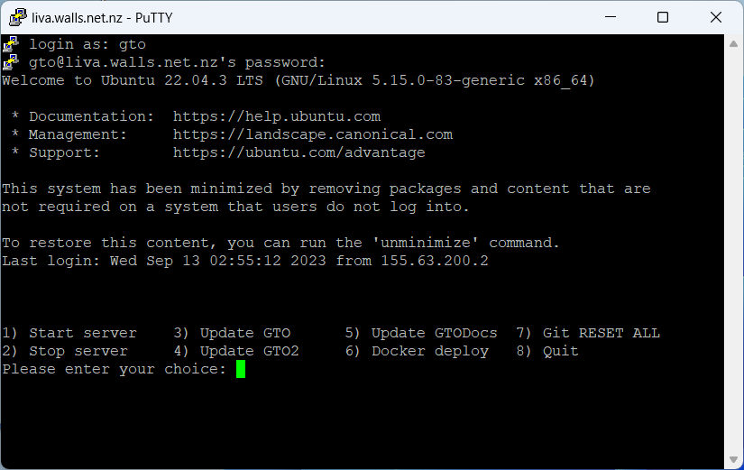

# GTO server SSH 

Version 1 of the server was hosted on a Virtual Machine on Edwin's personal web server (Thanks Edwin).  Version 2 is now hosted on a small dedicated headless linux server running on Jenny Wilkinson's home network (Thanks Jenny & John).  To Jenny & John this is just a small box in the corner, they aren't expected to do anything to help manage it. 

Server management is done using SSH.  Personally I use Putty on MS-Windows to manage the server, but any SSH client will work.

* URL : gto.canterburyglidingclub.nz
* Port : 22
* Account : gto
* Password : *Ask another admin*

Once you login an automatic bash menu script auto runs to help with typical server management tasks.

## Start server

Start the server.  The four server instances will show "Started" but they will still be doing the work of building the site and starting.  This can take up to 5 minutes if a new any code has been updated.  Typically GTO2 will take the longest to come up.

## Stop server

Stop the server.  This command is not typically needed as updating source code will also stop the servers.

## Update GTO

Stop the servers then pull the latest changes from GTO's git repo.  You will need to restart the servers when you have finished.

## Update GTO2

Stop the servers then pull the latest changes from GTO2's git repo.  You will need to restart the servers when you have finished.

## Update GTODocs

Stop the servers then pull the latest changes from GTODoc's git repo.  You will need to restart the servers when you have finished.

## Docker deploy

Upgrade and deploy a new docker image set that have previously been uploaded to the server.

## Git RESET ALL

This command is typically not needed.   It hard resets all three Git repositories if, for any reason, they have been manually changed.

## Quit

Exit to the bash shell for other server management tasks.

