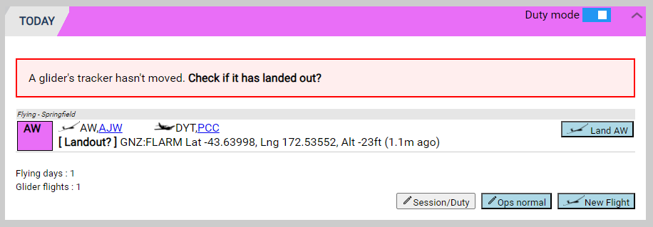

# Flight Following

The club Standard Operating Procedures (SOPs) specify the requirements for Operations Normal "Ops Normal" calls and position reporting:

> All pilots, when on soaring flights of more than thirty minutes, must give an "Ops Normal" radio call.
This call is to be made approximately every thirty minutes and is to be directed to the appropriate Glider Base. The call will be timed and recorded on receipt. The call will include, as a minimum, approximate position and height.

Additionally, glider pilots need to use a tracking system, such as Spot, Garmin Inreach, ADSB, or mobile phone tracking, to provide automated position reporting:

> a) A working SPOT or ADS-B transponder is to be used on all flights by club gliders and private gliders operated by CGC members from Springfield aerodrome.
>
> b) Prior to launch, correct SPOT or ADS-B tracking is to be confirmed by the glider pilot and, on a club operating day, by the duty pilot.
>
> c) If SPOT or ADS-B tracking fails during flight, the pilot must give position reports at least every 30 minutes to a suitable person on the ground stating position and intentions. A suitable person on the ground means someone who will initiate SAR action if the glider becomes overdue.

Every two minutes GTO obtains positions for flying giders from the [Gliding New Zealand tracking system](https://gliding.net.nz/tracking).  If more than 30 minutes have passed since an automated position report is received then the Today section of the Main page highlights the Glider that needs a Manual Ops Normal recorded:

{:.screenshot}

## Recording a Manual Ops Normal

Clicking either "Ops Normal" button presents a page where you enter the details of the Ops Normal report.
  
{:.screenshot}

Ideally include location and altitude and any other relevant details from the pilot:

{:.screenshot}

This clears the Yellow Bar and resets the timer.

## Overdue Glider

In accordance with the Club SOPs and Emergency Plan, a glider that has not had an automated position report or manual Ops Normal for more than one hour is deemed overdue and is displayed with a red bar:

{:.screenshot}

If you are able to contact the aircraft and get a satisfactory position report, enter a manual Ops Normal record which will clear the Overdue status and reset the Ops Normal timer.

## Stationary Tracker - Check for Landout

If a minimum of two, or all of the points GTO gets within the last five minutes, are within 50 m of each other then GTO highlights the glider's icon in magenta and the **TODAY** panel shows a magenta bar:

{:.screenshot}

For Spot and InReach devices with a slow reporting rate it could be more like 20 to 40 minutes to get two similar positions before GTO highlights a land out.  

If you do land out you need to keep your tracker on and in the glider for GTO to notice the landout.  Going for a walk with your tracker in your pocket will clear the GTO landout status.  The Spot and InReach preset landout messages sent with the OK, Help and Custom buttons are not considered when GTO determines if a glider has landed out.