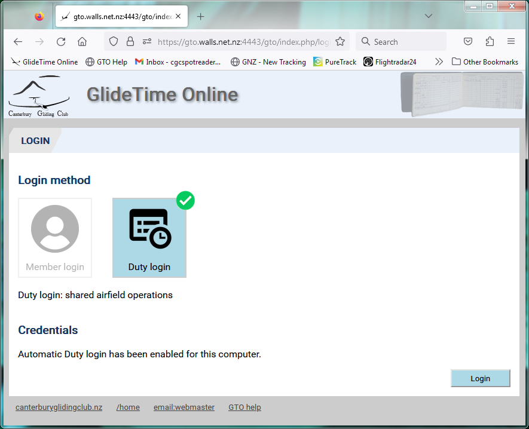
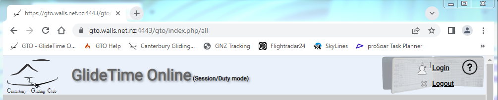
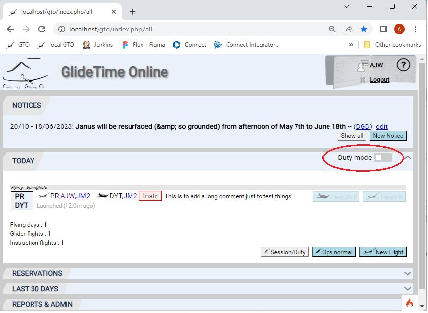

# About Logins

GTO is an online database of your club flying and training and we need everybody to have individual accounts. Individual accounts allow GTO to keep information private where appropriate.

## Login Page

This is the web page you land on: you need to enter your credentials for either Member login or Duty login

{:.screenshot}

{:.screenshot}

## GTO Automatic Duty login

Selected computers can be configured to allow GTO to not require account details for Duty login.  This feature is designed to provide automatic login for shared computers, physically located at the airfield, such as the laptop used for Ops control in the Kraak Kontrol building. You will not need to enter your personal account details to login for Duty Pilot.  The Kraak Kontrol laptop default login is now Duty login.

The screen shows the message that "Automatic Duty login has been enabled for this computer."

{:.screenshot}

The GTO header shows that you are in this mode:

{:.screenshot}

## Duty Mode and Launch and Land Buttons

The "Launch" and "Land" buttons will only work for Duty mode.  This makes it impossible to accidentally launch or land an aircraft from your phone or home computer.

Because occasionally you may want this functionality, a "Duty mode" switch has been added to allow you to enable these buttons temporarily, marked in red below.  This new switch re-enables the launch & land buttons in "Member login" mode.

{:.screenshot}

## How do I get Credentials to log in?

If you haven't registered then please follow the instructions in the [New User page](./New_user.md)
