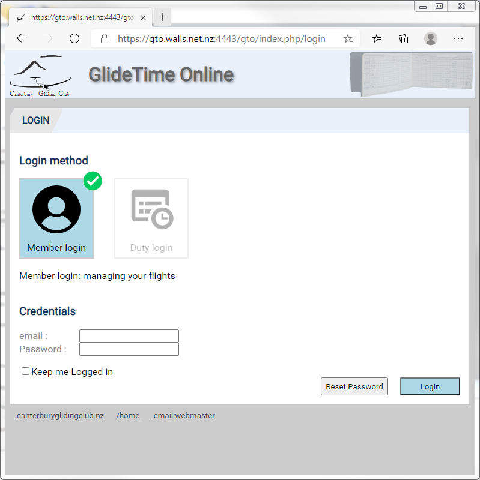
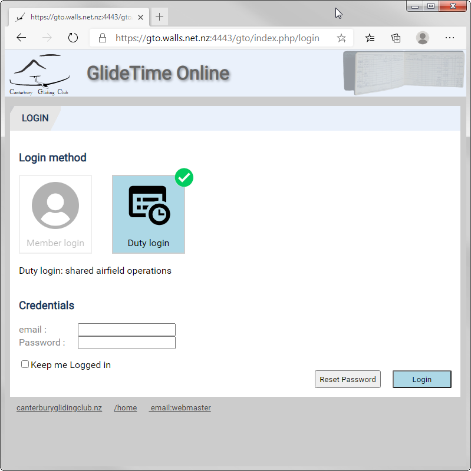

# About Logins

GTO is an online database of your club flying and training and we need everybody to have individual accounts. Individual accounts allow GTO to keep information private where appropriate.

## Login Page

This is the web page you land on: you need to enter your credentials for either Member login or Duty login

## How do I get Credentials to log in?

If you haven't registered then please follow the instructions in the [New User page](./New_user)

___
[Canterbury Gliding Club](https://canterburyglidingclub.nz/) &nbsp;&nbsp;&nbsp;&nbsp;&nbsp;&nbsp;&nbsp;&nbsp;[GTO Home](https://canterburyglidingclub.nz/gto) &nbsp;&nbsp;&nbsp;&nbsp;&nbsp;&nbsp;&nbsp;&nbsp; [GTO Help](https://gto.walls.net.nz:4443/gtodocs/)
