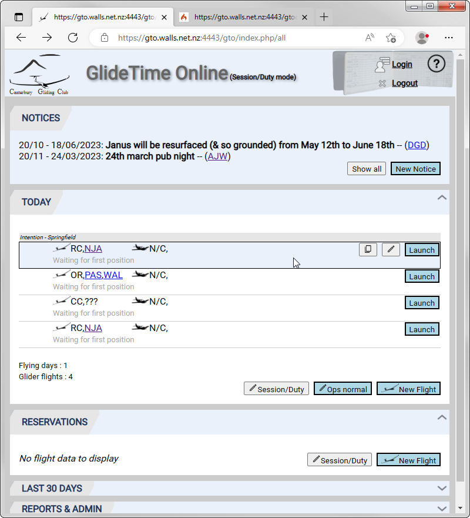
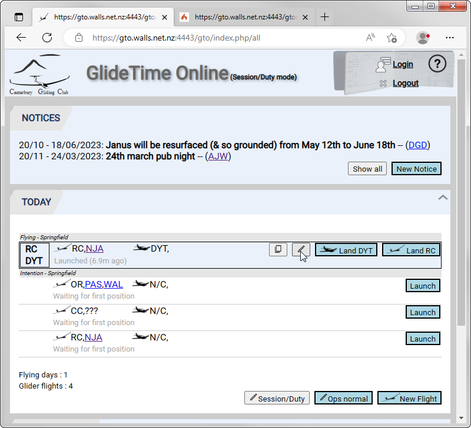
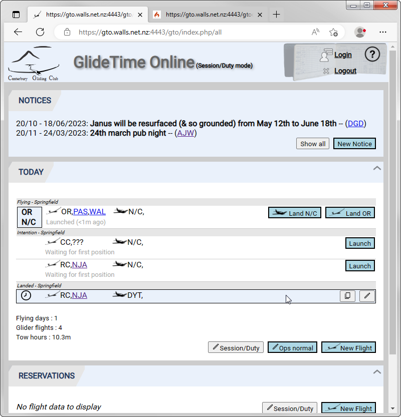

# Launching & Landing Flights

## Launching

The flying list of planned flights appears in the *Intention - Springfield* list of the [TODAY](./Today) section of the main page.  To launch one of these flights click the **Launch** button for the flight of interest.  When the mouse pointer hovers over a flight row, it is highlighted and the icons to **Copy flight** or **Edit flight** appear:

{:.screenshot}

Once launched the flight bar updates to appear in the *Flying - Springfield* list and also shows the active Towplane.  Hovering over the flight bar causes the **Copy flight** and **Edit flight** icons to appear.  Clicking **Edit flight** allows adding missing, or fixing incorrect, details as necessary:

{:.screenshot}

## Landing the Tow Plane

Click the button to **Land DYT** (in this example).  If the tow takeoff or landing times need adjusting then first, highlight the flight bar and click the **Edit flight** icon and next edit the **Launch** and/or **Towplane landing** times in the **Times** section of the window:

{:.screenshot}

## Landing the Glider

Click the **Land ...** for the appropriate glider.  THe completed flight then appears in the *Landed - Springfield* list, where any details may be edited if necessary:

{:.screenshot}
