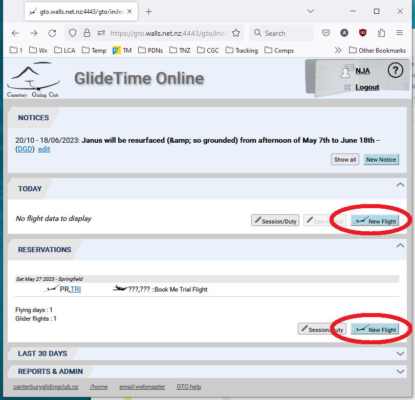
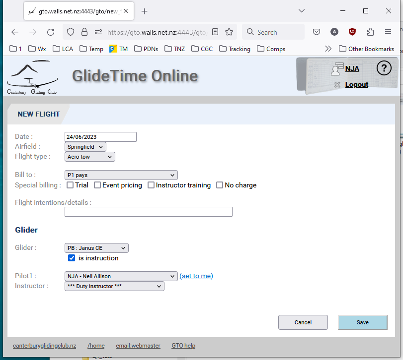
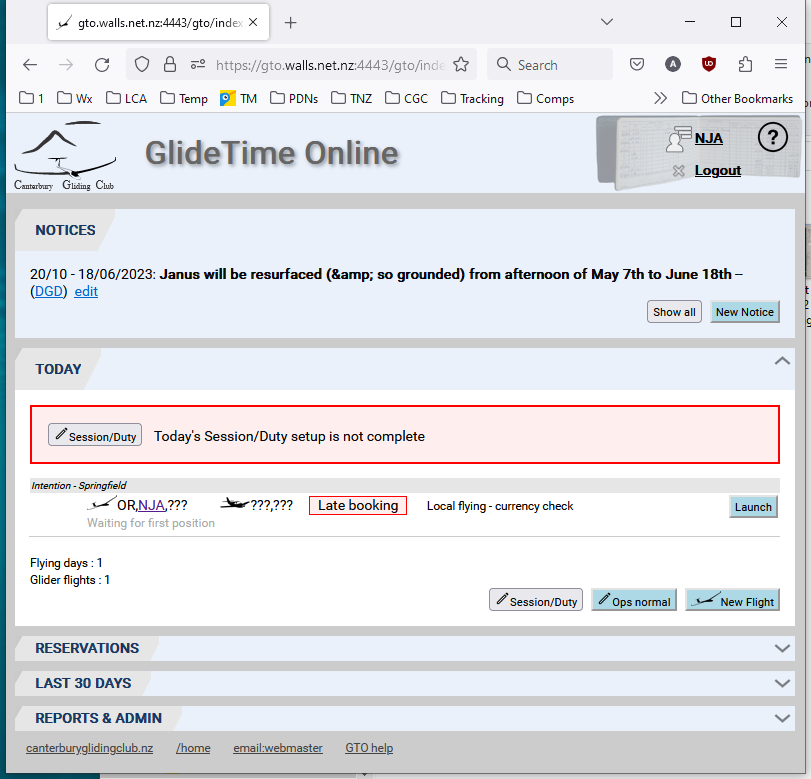
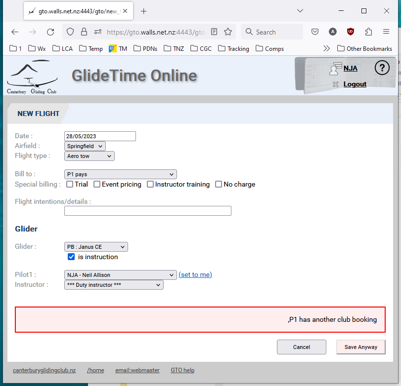

# Create a New Flight

Use the **New Flight** button to create a new [RESERVATION](./Reservations.md) for a future date or a flight for [TODAY](./Today.md).

{:.screenshot}

## Adding the New FLight Details

After clicking the **New Flight** button you are presented with a form to enther the details of the flight.  As a minimum set the date, the glider and the pilot name.  

{:.screenshot}

Additional fields and prompts may be shown depending on:
- If it is for today or a future date.
- If the booking is considered late when comparing today's date and the reservation date.
{:.screenshot}
- If you already have a reservation for that weekend.
{:.screenshot}
