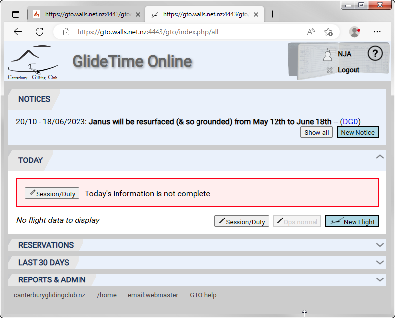
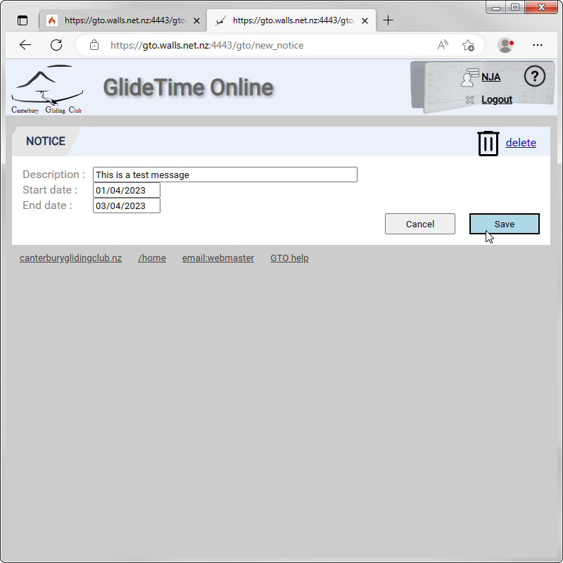
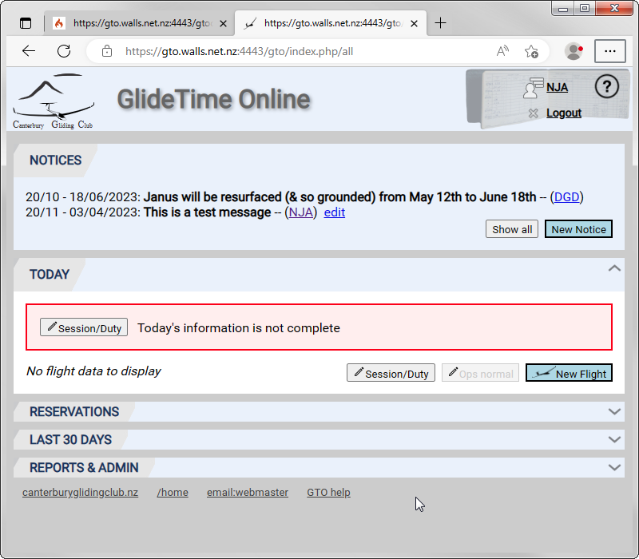
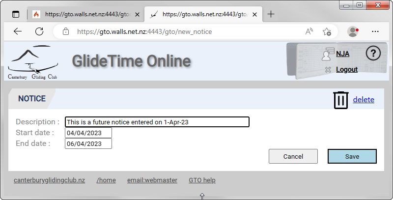
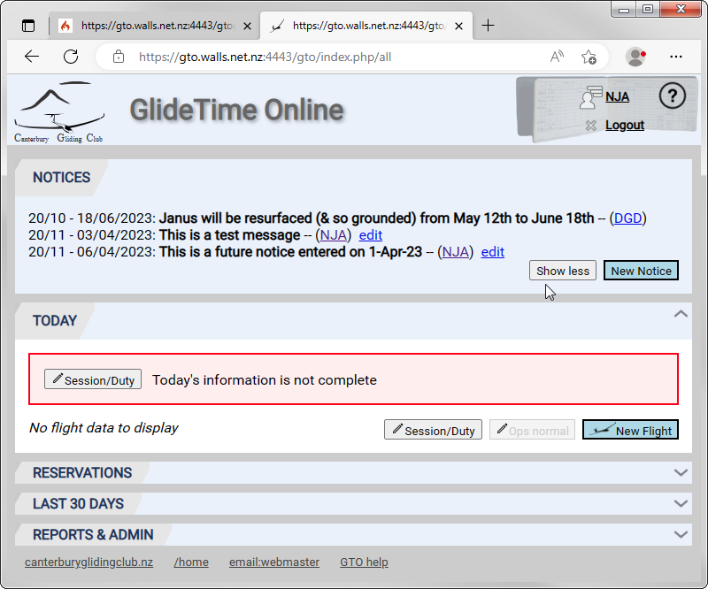

# Notices

This panel is at the top of the main page and is where operational notices are displayed and created.  By default, the current active notices are displayed but future notices may also be shown by clicking the **Show All** button.  Past notices are not able to be displayed, edited or deleted.

{:.screenshot}

The billing code for the person who created each notice is shown at the end of the message.  Only they, or an administrator, can edit or delete it.

## Creating a Notice

Click the **New Notice** button to add the message (description) and the effective dates for the notice to be displayed.  The notices will cease being displayed, and cannot be edited, after the end date.

{:.screenshot}

Now it is shown in the list of Notices:

{:.screenshot}

Click the **edit** link beside a notice you have created to edit or delete it.

## Notices with Future Effective Dates

A future dated Notice like this

{:.screenshot}

will not be shown in the NOTICES panel until the start date is reached unless the **Show All** button is clicked:

{:.screenshot}

Once the future messages are shown you are able to edit and/or delete notices you created.
