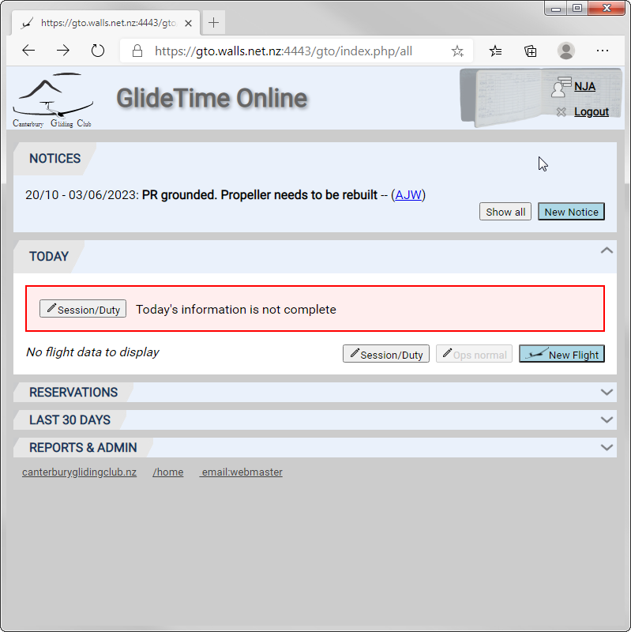
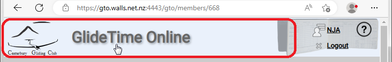

# GlideTime Online Screens Overview

This is the Main or Home screen of GTO that is displayed once you log in:

{:.screenshot}

The **NOTICES** panel is always displayed on the main screen and after logging in the **TODAY** panel is displayed (expanded).  Each of the **TODAY**, **RESERVATION**, **LAST 30 DAYS** and **REPORTS & ADMIN** sections may be expanded or collapsed by clicking on the arrow on the right hand end of their title bar.

The footer of each page has links to the CGC homepage, the Main (Home) screen of GTO, an email link to contact Alan, the GTO webmaster, and a link to the GTO help and documentation.

## Click header to go to home

From any page in GTO, simply click on the GlideTime Online header image at the top of the page to go to the Main (Home) screen:

{:.screenshot}
