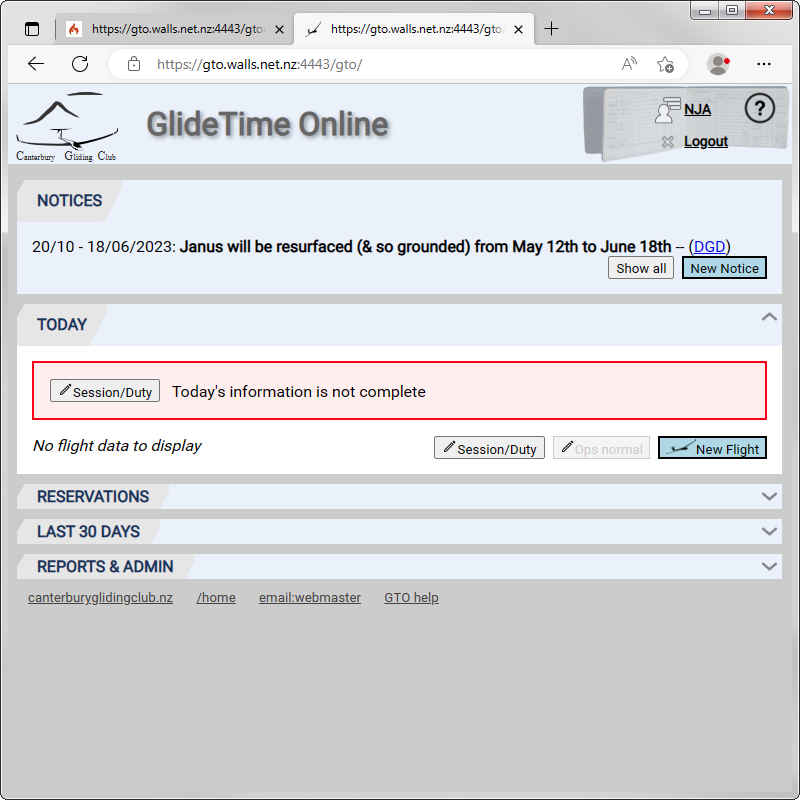

# GlideTime Online Screens Overview

This is the Main or Home panel of GTO that is displayed once you log in:

{:.screenshot}

The **[NOTICES](Notices.md)** panel is always displayed on the main screen.  Each of the **[TODAY](Today.md)**, **[RESERVATION](Reservations.md)**, **[LAST 30 DAYS](Last_30_days.md)** and **[REPORTS & ADMIN](Reports_Admin.md)** panels may be expanded or collapsed by clicking on the arrow on the right hand end of their caption bar.

The footer of each page has links to the [CGC homepage](https://canterburyglidingclub.nz/), the [Main (Home) screen of GTO](https://canterburyglidingclub.nz/gto), an email link to contact Alan, the GTO webmaster, and a link to the [GTO help and documentation](https://gto.walls.net.nz:4443/gtodocs/).

## Click header to go to home

From any page in GTO, simply click on the GlideTime Online header image at the top of the page to go to the Main (Home) screen:

{:.screenshot}
