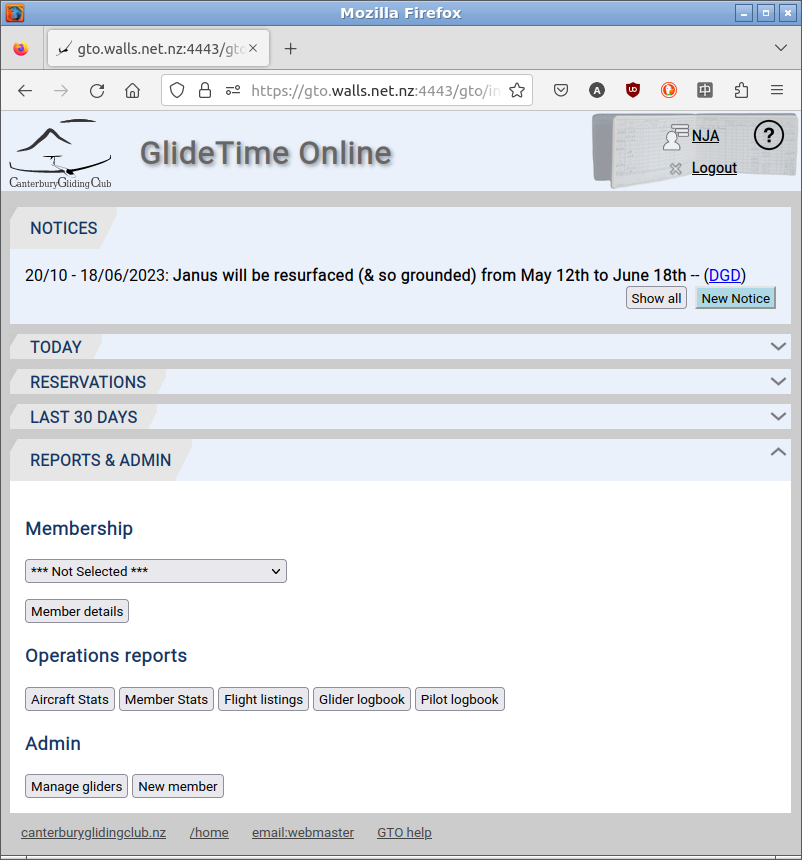
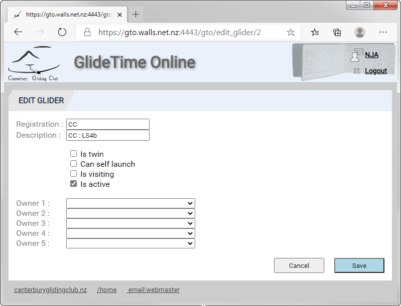
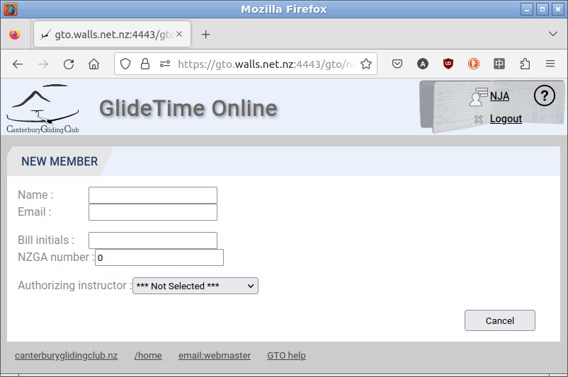

# Reports and Administration

GTO produces a variety of reports for pilots, accounts, engineering, instructors and the executive.  More reports may be added over time if there is demand.  Common reports may be found in the **REPORTS & ADMIN** section:

{:.screenshot}

## Reports

Some reports, such as the [Monthly Billing](./MonthlyBilling.md) are only available to admin accounts and so they don't appear in the list of available reports.  Otherwise the titles on the buttons are self explanatory.

## Admin

### Manage Gliders

This area provides pages to **Manage gliders**, including adding a new (or visiting) glider to the database.

First, click the **Manage gliders** button to go to the list of known gliders. Click the **New Glider** button at the bottom of the page to add a new aircraft.

To update a glider's data, scroll to the glider you wish to update and click the Edit Glider button on the right hand side and edit the details:

{:.screenshot}

### Add a New Member

A very important feature is adding a **New Member** by clicking the button at the bottom of this page.  GTO has a membership editing mode that allows full editing for the day the member was created.  That allows a duty pilot to enter and update new member details at various points during a day, e.g. create a membership when the pilot is having a chat with an instructor then later complete more details.

{:.screenshot}

More information is in the [New User](./New_user) page.
