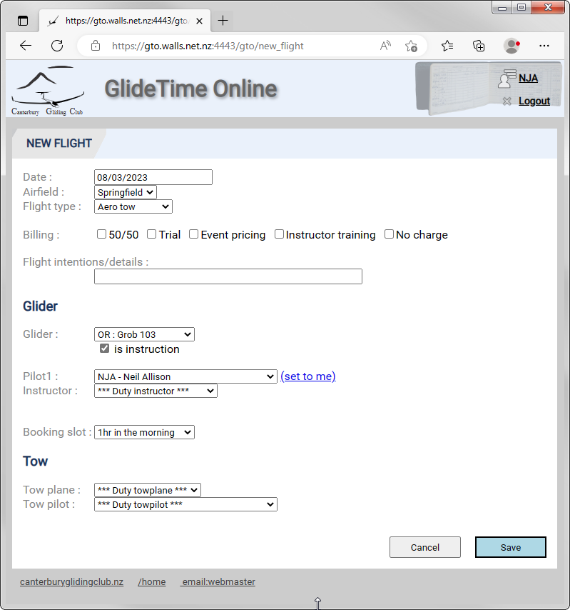
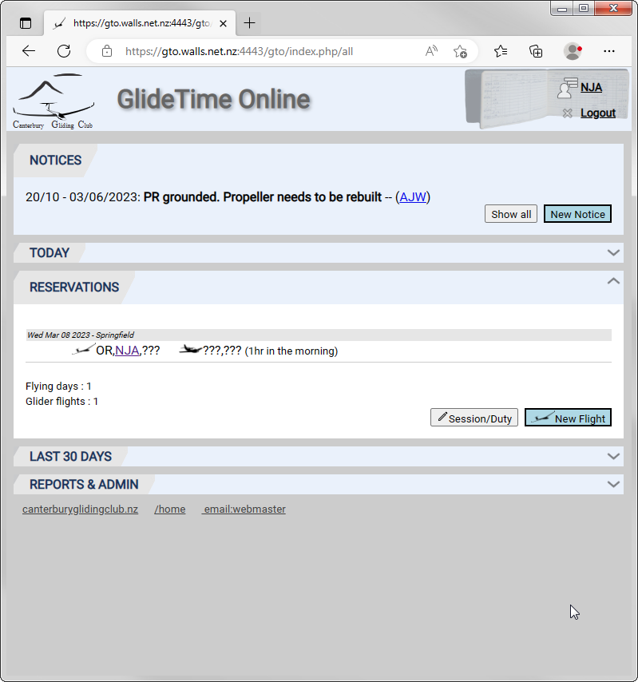
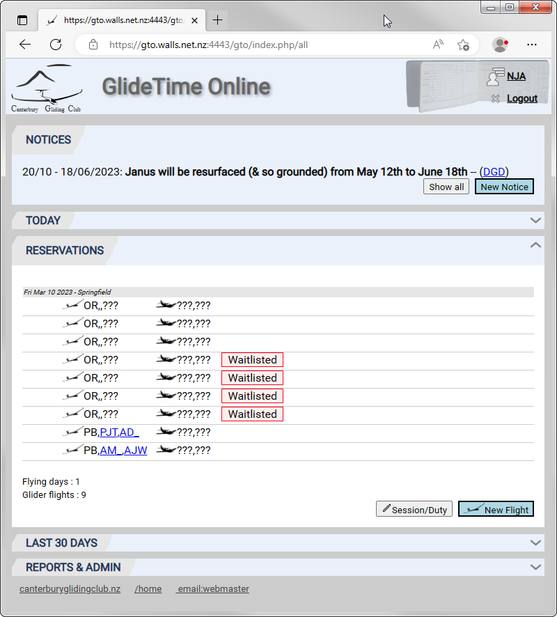

# Reservations

***This page is incomplete and under review, clarification and editing.  The content may change daily or perhaps more often.***

Also known as Bookings, the Reservations page is where you make and amend your aircraft and instruction requests and you can see what other reservations have been made.

## Why do we need Reservations?

In Ye Olde Days, the CGC ran a daily flying list with a "first come, first served" method of adding your name and glider preference to the day's flying list to get a notional "one hour" or "three short training flights" session.  Officially, it was not possible to book a glider on a day in the future although informal discussions and plans were sometimes made to accommodate badge or rating flights.  Trial flights were scheduled separately but the number and "departure time" for these was not visible to the members.  

The club has had increased requests for a booking system and the GTO reservations system accommodates three main categories:

1. Members needing an instructor's time (this covers flight training, BFR, ratings, Ground school, etc).

1. Members wishing to book club gliders for their own use.

1. Trial Flights.

### Members needing an instructor's time  

A prime issue is that Instructors have no control over their workload for the day and it only takes one random show on a day to scupper their plans. So, we need to limit the total number of students to three per instructor to allow a good 2 hour session for each pilot. We need a way for members to book an instructor on a first come, first served basis. Once three pilots have reserved an instructor, future pilots making a reservation will be added to a waiting list.  If there is a waiting list we intend that the Duty Instructor attempts to get additional instructor/s to help. If no additional instructor is available, then the duty instructor notifies the waiting list that there is no additional instructor and they will have to find another day (but at least they have not wasted a trip to the airfield).

GTO will apply the agreed rules to reservations:

1. Student signup list - limited to three per instructor.
1. Bookings should be made 24 hours before the day, otherwise a "Late Booking" tag is added.
1. Pilots may only book once per day.
1. Additional bookings are wait listed, up to a maximum of three (i.e. another instructor).
1. Students don't book a glider, just a Grob 103.

### Members wishing to book club gliders for their own use

The Club wants to encourage members to get out flying and many pilots have requested the ability to book a club glider.  After much discussion, the following gliders should be available to book for a **day** (i.e. we will not split the day further):

* CC
* MQ
* PB (There is a proviso that PB can be used for flight training between 10am and 12pm. However the duty instructor would notify someone who had booked PB).

Again, GTO will apply the agreed rules to reservations:

1. You can only book one aircraft per day.
1. **TBD** Bookings close 12 hours before the day or are tagged as a Late Booking.
1. Bookings can be made up to **TBD**/five days in advance.

## Making a Reservation

From the  Reservation section of the Main page, click the New Flight button and you are presented with a form to enter the details of your reservation.  As a minimum, include the date, glider and your name:

Click the Save buton and you are returned to the Main page where your new reservation is listed:

## More details about the Reservation Rules

The rules are desgned to  meet the instructor and student requirements while still handling a number of "corner cases" including Trial Flights and Group Winching Days.

1. Multiple bookings with the same P1/date/glider are considered as a single booking.  This allows a student (or Duty pilots) to pre-enter multiple flight intentions.  The assumption is this is a single hour's flying as per normal club operations.

1. Pilots are limited to one club glider booking at a time.  You can not book both days of a weekend.  This is to allow other students a chance to book.  Instructors/Admin can override this limit and place the booking.

1. Trial flights are a special case.  They have no booking limits.  They are not waitlisted.  Should a trial flight be counted as part of the rostered instructors workload limit?

1. Non club glider bookings have no restriction.

1. For a number of reasons a flight can be tagged as "Waitlisted".  From GTO's point of view, these flights can still be entered/edited/flown as normal.  As normal, the duty instructor on the day will decide who can fly & when.

1. OR/PR are primary training gliders, on any day they can handle 3 instruction bookings per rostered instructor.  Beyond that, instruction flights can be booked but they will be tagged as "Waitlisted".

1. Instruction has priority on OR/PR.  Non-instruction flights in OR/PR are always marked as "Waitlisted" if any rostered instruction is booked for that day.  Even if the non-instruction flight was booked first.

1. All other club gliders are limited to one booking per day.  Beyond that, flights can be booked but they will be tagged as "Waitlisted".

1. GTO assumes one instructor is available unless an "Extra instructor" is set in the Session/Duty page.  Then two instructors are available.

1. Beyond the two rostered instructors, flights can be specifically assigned an alternate instructor.  These flights will not be counted as part of the rostered instructor limits.

___
[Canterbury Gliding Club](https://canterburyglidingclub.nz/) &nbsp;&nbsp;&nbsp;&nbsp;&nbsp;&nbsp;&nbsp;&nbsp;[GlideTime Online Home](https://canterburyglidingclub.nz/gto) &nbsp;&nbsp;&nbsp;&nbsp;&nbsp;&nbsp;&nbsp;&nbsp; [GlideTime Online Help - (Wiki Version)](https://github.com/nallison/GTODocTest/wiki) &nbsp;&nbsp;&nbsp;&nbsp;&nbsp;&nbsp;&nbsp;&nbsp; [GlideTime Online Help - (Web Version)](https://nallison.github.io/GTODocTest/)
