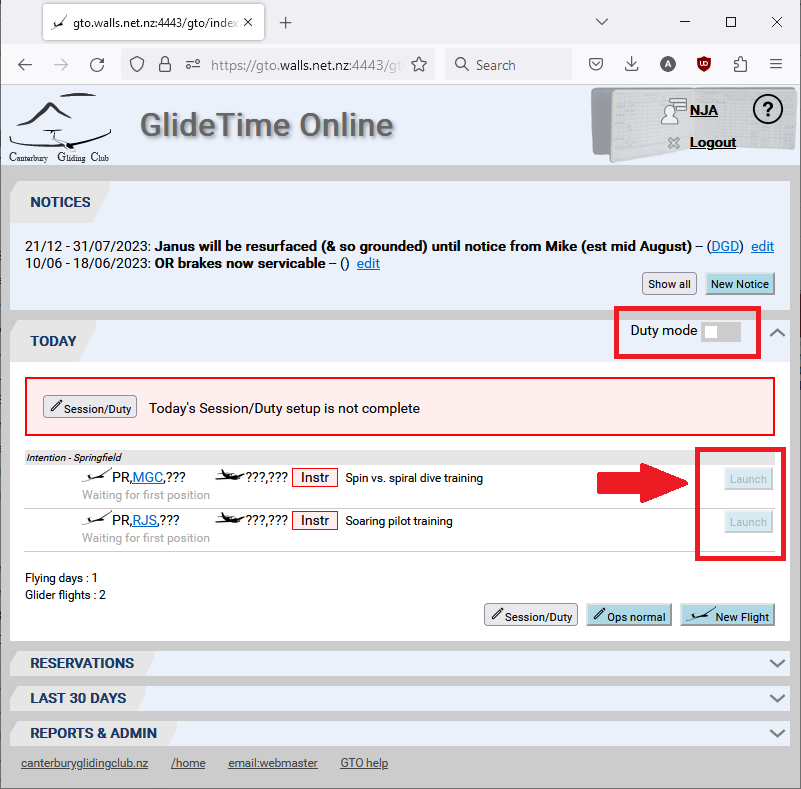
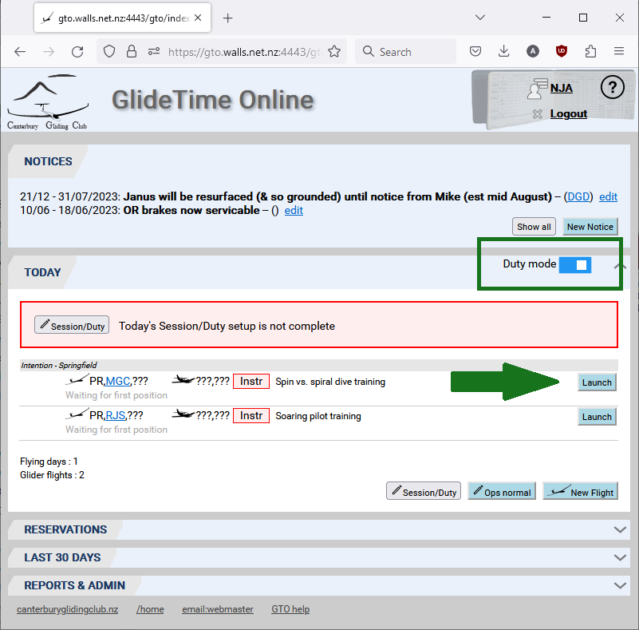
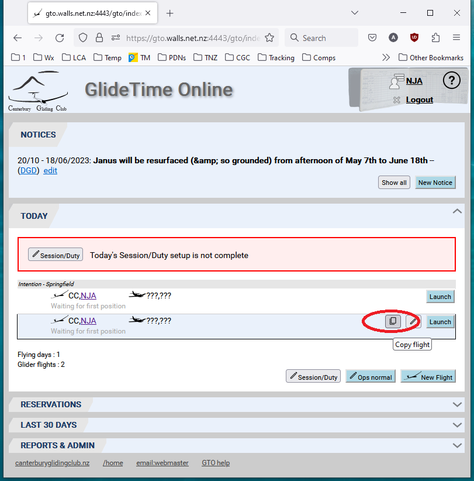
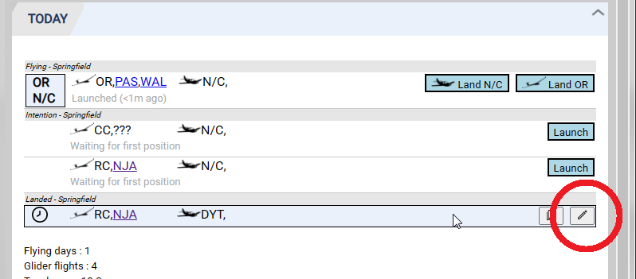
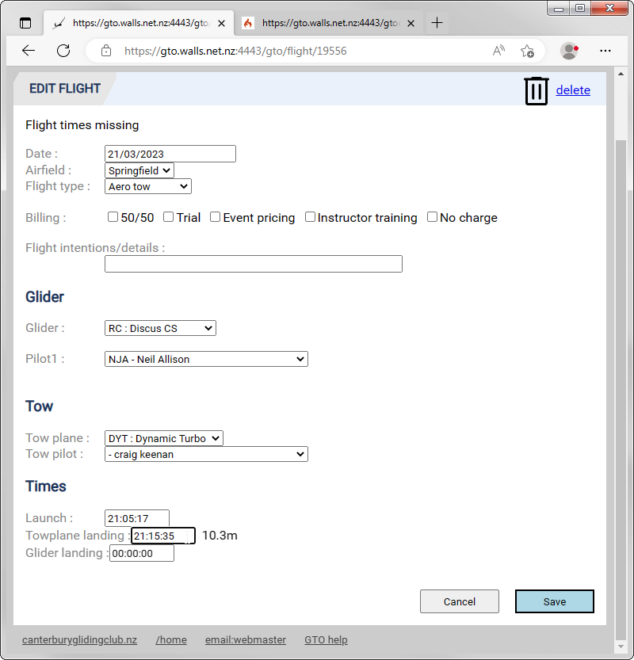
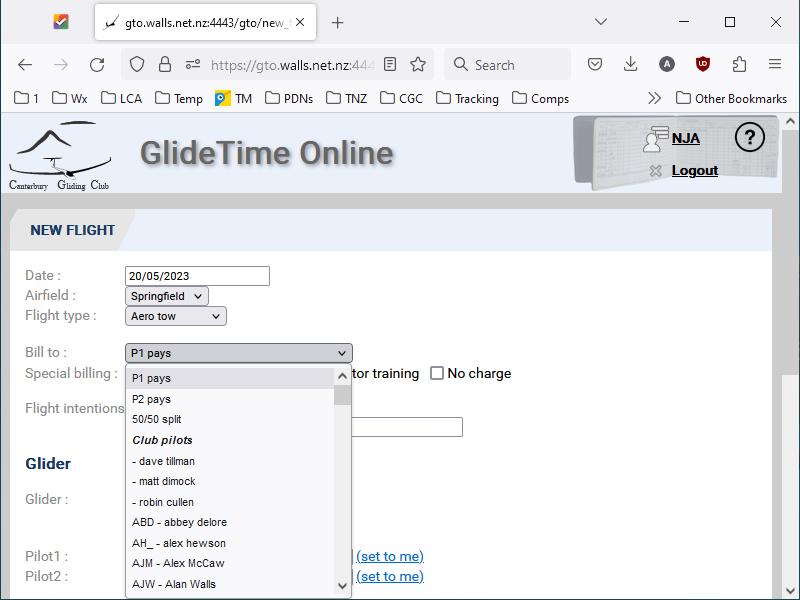

Here's a list of helpful hints, tips and tricks to help you make the most of GTO.

[TOC]

# Tips and Tricks

## Why can't I Launch or Land a flight?

The "Launch" and "Land" buttons will only work for Duty mode.  For Member login mode, the Launch and Land Buttons are inactive (greyed out) to prevent accidentally launching or landing an aircraft from your phone or home computer.  

{:.screenshot}

 A "Duty mode" switch has been added to allow you to enable these buttons in "Member login" mode.

{:.screeenshot}

## How to Add a New Member

Go to the [REPORTS & ADMIN](./Reports_admin) panel of the main page and click the **New Member** button at the bottom of the page.

## How to copy a flight

Highlight the flight of interest and click the **Copy Flight** button.  This will make a new flight record and open it in the Edit Flight page for you to update the details.

{:.screenshot}

## Click header to go to home

From any page in GTO, simply click on the GlideTime Online header image at the top of the page to go to the Main (Home) screen:

{:.screenshot}

## Hover over pilot billing tag to see name

Do you need to know the person's name for a three letter billing tag?  Hover the mouse pointer over the tag and the name will be displayed.

{:.screenshot}

## Hover over time icon to see flight times

## Delete unflown flight to avoid nag emails

## "GNZ tracking working" message on flights before launch

Once a flight is entered, and before it is launched, GTO will display the "GNZ tracking working" message tracking positions are being received for this glider from [Gliding New Zealand tracking system](https://gliding.net.nz/tracking)

{:.screenshot}

## Adjusting flight times when you forgot

Highlight the flight record bar of the flight that needs adjusting, whether airborne or landed as in this example, and click the **Edit flight** icon, here circled in red:

{:.screenshot}

Now, edit the **Launch**, **Towplane landing**  and/or **Glider landing** times in the **Times** section of the window:

{:.screenshot}

## Using GTO to call or email somebody

## How to split the cost of a flight

In the [New Flight](./New_flight.md) or Edit Flight form there is an option to set the **Bill To** field to:

- P1 pays: the normal (default) situation where Pilot1 listed on the flight record pays.  Here, P1 is not (necessarily) synonymous with Pilot in Command.

- P2 pays: when the Pilot2 on the flight record pays.  For example you fly with Terry or Michael in an ASH25 and you pay the launch and landing fees.

- 50/50 split: equally shared.

- Club pilots: bill the flight to this member's flying account.  For example you get another pilot or instructor to take a family member for a flight and you will be paying at normal club rates.

What about if Pilot1 and Pilot2 wants to split the cost some other way or P2 wants to pay for 5 minutes of a long tow?  GTO doesn't support this: please sort it out between yourselves.

{:.screenshot})
