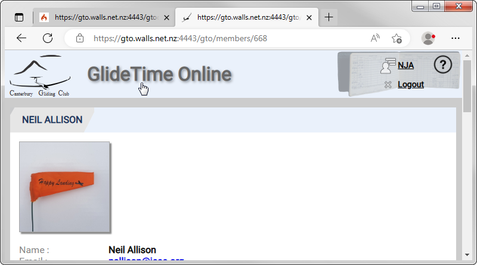
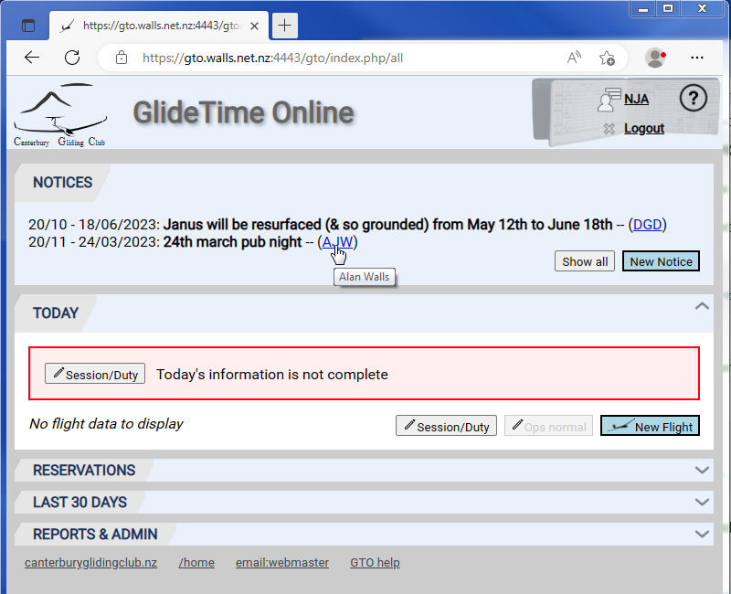
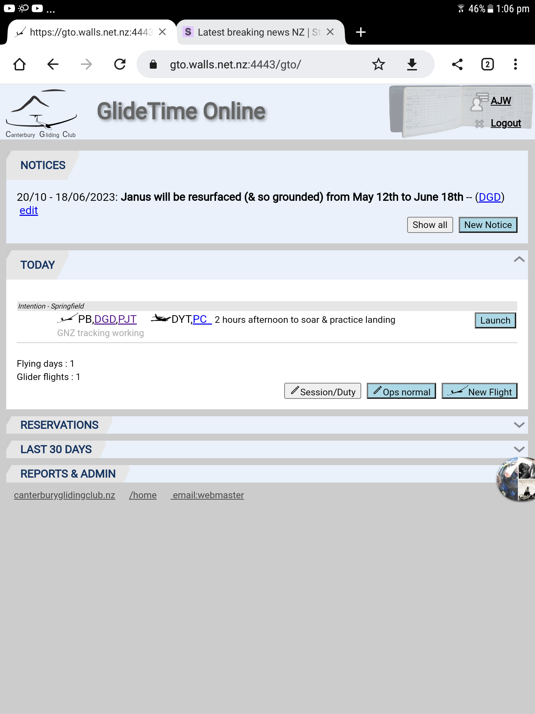

Here's a list of helpful hints, tips and tricks to help you make the most of GTO.

[TOC]

# Tips and Tricks

## How to copy a flight

## Click header to go to home

From any page in GTO, simply click on the GlideTime Online header image at the top of the page to go to the Main (Home) screen:

{:.screenshot}

## Hover over pilot billing tag to see name

Do you need to know the person's name for a three letter billing tag?  Hover the mouse pointer over the tag and the name will be displayed.

{:.screenshot}

## Hover over time icon to see flight times

## Delete unflown flight to avoid nag emails

## "GNZ tracking working" message on flights before launch

Once a flight is entered, and before it is launched, GTO will display the "GNZ tracking working" message tracking positions are being received for this glider from [Gliding New Zealand tracking system](https://gliding.net.nz/tracking)

{:.screenshot}

## Adjusting flight times when you forgot

## Using GTO to call or email somebody
