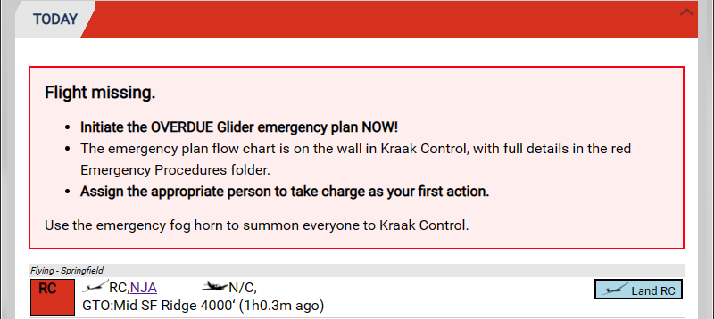

# Today

This is the area of GTO where most of the activity occurs.  As well as showing the flying list it also indicates when the day's session information is not complete and when flying aircraft need to provide an [Ops Normal or is Overdue](./Flight_following.md).

## Session and Duty Information

Upon first logging in, a duty pilot will see the message that the day's information is incomplete.  

{:.screenshot}

Click either **Session/Duty** button to fill this in:

{:.screenshot}

Now the **TODAY** panel shows the flying list which will automatically be populated with any reservations that have been made for today.  Click the **Session/Duty** button to edit the day's data or comments at any time during the day.  Click the [New Flight](./New_flight) button to enter a flight to the flying list.

{:.screenshot}

## Time Keeping

The club requires flight takeoffs and landings are recorded.  How GTO provides for this is explained in the [Launching & Landing Flights](./New_flight) page.

## Flight Following

We provide flight following for gliders launched during club operations.  GTO automates the collection of postion information provided by Spot, Inreach, ADSB and cellphone tracking from the GNZ tracking system.  This is explained in [Flight Following & Ops Normal](./Flight_following).

The **TODAY** panel highlights any gliders that need to provide a manual Ops Normal with yellow shading:

{:.screenshot}

If there is no automated position report or manual Ops Normal for more than one hour then the **TODAY** panel shows a red bar, lists the essential next steps and highlights the aircraft concerned:

{:.screenshot}

After a glider has launched, when the newest GNZ tracker positions show less than 50 m of movement in the last 5 minutes then GTO highlights its icon in magenta and the **TODAY** panel shows a magenta bar:

{:.screenshot}

For frequently updating trackers, this indication means stationary for the last 5 minutes.  For Spot's slow reporting rate it will be more like 20 to 40 minutes as it could take that long to get two similar positions.  If you do land out you need to keep your tracker on and in the glider for GTO to notice the landout.  Going for a walk with your tracker in your pocket will clear the GTO landout status.  The Spot and InReach preset landout messages of OK, Help and Custom are not considered when GTO determines if a glider has landed out.
